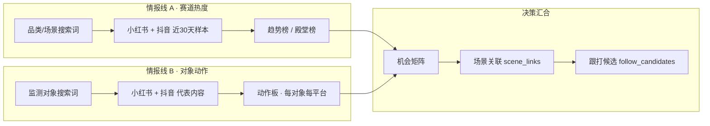

# 小红书 × 抖音 · 双平台内容爆款月报

> 作者：[shutiao165-tech](https://github.com/shutiao165-tech) · https://github.com/shutiao165-tech/social-ecom-monthly-report

**一句话**：把小红书 + 抖音近 30 天的公开内容，整理成一份**能直接拿去开会、写 brief、排优先级**的双平台月报——不是原始数据 dump，而是带判断框架的情报产品。

本仓库开源的是**方法论 + 报告模板 + 自动化流水线**；不含任何真实赛道词表或业务数据，fork 后自行配置即可复用。

**当前版本 v0.3**（2026-06）· 变更记录见 [CHANGELOG.md](CHANGELOG.md)

TikHub 注册（邀请）：https://user.tikhub.io/register?ref=YS1mhMDA

---

## 给商业分析 / 运营：这份月报在干什么？

传统做法是：运营各自刷平台、截图、拼 Excel，**热点和竞品动作混在一起比赞**，结论主观、难复盘、难跨月对比。

这套模型的核心主张只有一句：

> **「市场在火什么」和「监测对象在做什么」是两类问题，必须分开看，最后在一张决策表里汇合。**

| 业务问题 | 月报里对应什么 | 典型用法 |
|----------|----------------|----------|
| 赛道最近什么话题在升温？ | 品类池 · 趋势榜 / 殿堂榜 | 选题会、内容日历、投放方向 |
| 各监测对象最近在发什么？挂不挂车？ | §02 动作板 | 竞品复盘、威胁判断 |
| 我们该跟哪个场景、资源投在哪？ | §03 机会矩阵 + scene_links | brief、达人 brief、信息流脚本 |

---

## 核心模型：双情报线 · 四层决策

### 双情报线（方案 C）

不要把「全网爆款」和「某家代表片」放在同一张榜里比——前者反映**需求侧热度**，后者反映**供给侧动作**，混比会系统性误判。



**情报线 A — 赛道在聊什么（需求侧）**  
用「品类/场景词」搜，回答：用户最近在关心什么痛点、什么内容形态在起量、哪些话题值得跟。

**情报线 B — 对象在做什么（供给侧）**  
用「监测对象词」搜，回答：谁在高赞发声、发的是种草还是剧情、有没有挂品/挂车、主推哪条产品线。

**汇合层 — 所以我们该怎么做**  
把 A 的热度和 B 的动作叠在一起，输出：**跟打 / 观望 / 差异化切入**，并落到具体场景与内容 playbook。

---

### 四层决策框架（从数据到结论）

这是整份月报的「逻辑骨架」，也是和纯数据看板最大的差别：

| 层级 | 商业含义 | 你在报告里看到什么 |
|------|----------|-------------------|
| **L1 分池采集** | 先定义「看市场」还是「看对象」，避免指标串味 | 品类榜 vs 动作板分开展示 |
| **L2 可信命中** | 只认标题/正文里真实出现的关键词，不认「标签蹭词」 | 未命中会标注「本批未出现」 |
| **L3 商业复核** | 区分种草、挂车、无商业；舆情/资讯单独分流 | 挂品标签 + 舆情虚线栏 |
| **L4 行动建议** | 从「发生了什么」推到「建议做什么」 | 机会矩阵、scene_links、跟打清单 |

用运营语言串起来就是：

```text
定义监测范围（配置词表）
    → 双路拉数（赛道词 + 对象词）
    → 去噪 & 商业标注（是不是真相关、有没有带货）
    → 汇总成一张 HTML 月报（趋势 + 动作 + 建议）
```

每月重跑同一套流水线，**对比的是结构化的结论，不是某次手工截图**。

---

## 数据质量：v0.2 为什么更「能信」？

早期双平台监测的通病：搜索词太宽 → 脏数据进榜 → 结论被噪声带偏。v0.2 加的是**情报质量控制层**，用商业语言理解如下：

| 机制 | 解决什么业务痛点 | 报告里的表现 |
|------|------------------|--------------|
| **歧义词组合搜索** | 同一个词在多行业都有含义（如简称、常用词），裸搜会搜到无关爆款 | 抖音侧改用「对象×品类」组合词，减少张冠李戴 |
| **赛道相关性过滤** | 标题蹭了关键词，但内容和赛道无关 | 未通过相关性的样本不进代表片 |
| **舆情 / 资讯分流** | 把维权、媒体报道和正常种草混在一起，会高估「内容声量」 | 动作板：种草最多 3 条；舆情/资讯单独一栏 |
| **代表片优先级** | 高赞但无产品信息的帖子，对 brief 价值低 | 有挂品/单品信息的片段优先展示 |
| **二次清洗** | 合并多数据源后仍有漏网噪声 | 汇总前再筛一轮，保证动作板可解释 |

**五条铁律（写进模型里的原则）**

1. **双池不混比** — 市场热度榜 ≠ 对象声量榜  
2. **命中可解释** — 每条代表片都能说清楚「为什么算它」  
3. **歧义必收窄** — 容易误搜的词，不用裸词硬搜  
4. **舆情单列** — 负面/媒体声量不冒充种草爆款  
5. **没信号就留白** — 某板块无数据则隐藏，不硬凑结论  

---

## 月报结构速览（开会怎么用）

```text
┌─────────────────────────────────────────────────────────┐
│  总览：本月赛道一句话 + 双平台热度分布 + 核心结论        │
├─────────────────────────────────────────────────────────┤
│  §01 趋势：品类池榜单 — 「市场在给什么议题流量」         │
├─────────────────────────────────────────────────────────┤
│  §02 动作板：监测对象 — 「谁在做什么、带不带货」         │
│       └ 种草代表片（≤3）/ 舆情栏 / 资讯栏               │
├─────────────────────────────────────────────────────────┤
│  §03 机会矩阵：热度 × 动作 → 跟打 / 差异化 / 观望      │
├─────────────────────────────────────────────────────────┤
│  scene_links：场景 — 趋势 — 对象 — 建议 SKU/话术        │
└─────────────────────────────────────────────────────────┘
```

**推荐节奏**：先看总览定调 → 趋势榜找选题 → 动作板看竞争 → 机会矩阵排优先级 → scene_links 写 brief。

---

## 文档入口

| 文档 | 适合谁 |
|------|--------|
| **[docs/USAGE.md](docs/USAGE.md)** | 第一次跑通、每月重跑、报告怎么读 |
| [docs/WORKFLOW.md](docs/WORKFLOW.md) | 需要了解数据从哪来、脚本怎么串 |
| [docs/SETUP.md](docs/SETUP.md) | 安装 TikHub / decoder |
| [config/README.md](config/README.md) | 配置监测词表与 playbook |

---

## 快速开始

```bash
git clone https://github.com/shutiao165-tech/social-ecom-monthly-report.git
cd social-ecom-monthly-report

cp config/niche_config.example.py config/niche_config.py
# 填写：赛道名、品类词、监测对象词、内容 playbook

mkdir -p ~/.config/tikhub && echo "YOUR_TIKHUB_KEY" > ~/.config/tikhub/key
export SOCIAL_ECOM_DECODER=~/.claude/skills/social-ecom-decoder

bash scripts/run_monthly_pipeline.sh
open monthly-report.html
```

### Cursor Skill

```bash
mkdir -p ~/.cursor/skills
cp -R cursor-skills/brand-viral-monthly-report ~/.cursor/skills/
```

---

## 附录：技术实现（给搭建的同学）

<details>
<summary>点击展开 — 脚本与文件对照</summary>

### 流水线

```text
niche_config.py
    ├─► XHS: fetch → enrich_commerce → data/xhs-monthly/
    ├─► DY:  douyin-pulse（品类 + 对象）→ merge_douyin_pulse.py
    └─► build_unified_monthly.py → monthly-report.html
```

入口：`bash scripts/run_monthly_pipeline.sh`

### v0.2 模块对照

| 能力 | 文件 |
|------|------|
| 赛道相关性 | `scripts/relevance_filter.py` |
| 歧义组合词 | `scripts/brand_config.py` → `dy_brand_keywords_*` |
| DY 二次清洗 | `scripts/merge_douyin_pulse.py` |
| 舆情/资讯识别 | `scripts/competitor_enrich.py` |
| 报告汇总 | `scripts/build_unified_monthly.py` |

</details>

### 目录

| 路径 | 作用 |
|------|------|
| `config/niche_config.example.py` | 配置模板 |
| `config/niche_config.py` | 本地配置（不提交） |
| `scripts/run_monthly_pipeline.sh` | 一键流水线 |
| `monthly-report.html` | 报告输出 |

---

## 隐私与提交

- 不提交 `.env`、`config/niche_config.py`、`data/` 运行产物  
- 不含内网链接、真实 brief、业务侧词表  

---

## 相关

- [dingtalk-stock-watch](https://github.com/shutiao165-tech/dingtalk-stock-watch) — 同类「架构开源、数据自备」范式  

MIT — [LICENSE](LICENSE)
