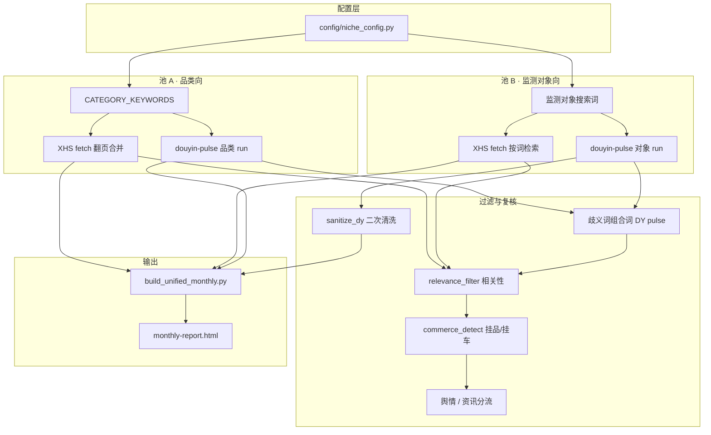

# 小红书 × 抖音 · 双平台内容爆款月报

> 作者：[shutiao165-tech](https://github.com/shutiao165-tech) · https://github.com/shutiao165-tech/social-ecom-monthly-report

开源的是**采集架构、过滤模型与 HTML 报告模板**——用 TikHub 拉双平台近 30 天样本，经商业复核与噪声过滤后，输出单文件 `monthly-report.html`。

本仓库**不含**任何真实赛道词表、监测对象或运行数据；fork 后复制 `config/niche_config.example.py` → `niche_config.py` 自行填写。

**当前版本 v0.2**（2026-06）· 完整变更见 [CHANGELOG.md](CHANGELOG.md)

tikhub邀请链接：https://user.tikhub.io/register?ref=YS1mhMDA

---

## 文档入口

| 文档 | 内容 |
|------|------|
| **[docs/USAGE.md](docs/USAGE.md)** | 第一次使用、每月重跑、报告怎么读 |
| [docs/WORKFLOW.md](docs/WORKFLOW.md) | 流水线逐步说明 |
| [docs/SETUP.md](docs/SETUP.md) | TikHub / decoder 安装 |
| [config/README.md](config/README.md) | `niche_config.py` 字段说明 |

---

## 解决什么问题？

| 你想知道… | 报告里看… |
|-----------|-----------|
| 赛道什么内容在火？ | 品类池 · 趋势榜 / 殿堂榜 |
| 监测对象最近在发什么、挂不挂车？ | §02 动作板 |
| 该跟哪个话题、主推哪条线？ | §03 机会矩阵 + scene_links |

---

## 跑通模型（方案 C · 双池）

两路采集**并行、分开展示**——品类 UGC 爆款热度 ≠ 监测对象代表片声量，禁止混榜比较。



### 四层结构

| 层级 | 职责 |
|------|------|
| **L1 双池** | 品类热点池 vs 监测对象池，数据源与榜单分离 |
| **L2 过滤** | 标题/正文命中校验、hashtag 防蹭、歧义词组合搜索、赛道相关性 |
| **L3 商业** | 挂品 / 挂车 / tag 复核；舆情与资讯从种草代表片分流 |
| **L4 决策** | 动作板（每对象每平台 ≤3 条，有品优先）+ 机会矩阵 + scene_links |

### 一键流水线

```text
niche_config.py
    │
    ├─► XHS: fetch_xhs_monthly_tikhub.py → enrich_commerce.py
    │         └─► data/xhs-monthly/{merged_raw,analysis}.json
    │
    ├─► DY:  douyin-pulse（品类 + 对象）→ merge_douyin_pulse.py
    │         └─► data/douyin-monthly/analysis.json
    │
    └─► build_unified_monthly.py → monthly-report.html
```

入口：`bash scripts/run_monthly_pipeline.sh`（douyin-pulse 在上游 [social-ecom-decoder](https://github.com) 单独跑，见 USAGE）

---

## v0.2 优化细节（已落地）

生产环境迭代后回灌到本仓库的能力，均可通过 `niche_config.py` 开关或留空关闭。

| 模块 | 文件 | 做什么 |
|------|------|--------|
| **赛道相关性** | `scripts/relevance_filter.py` | 强/弱锚词、负向词、歧义对象上下文共现；XHS + DY 共用 `mentions_brand()` |
| **歧义搜索词** | `brand_config.dy_brand_keywords_*` | DY pulse 对歧义监测词跳过裸词，只用「对象×品类」组合词 |
| **DY 二次清洗** | `merge_douyin_pulse.sanitize_dy_*` | 合并后按相关性重筛代表片，刷新 insights / summary |
| **舆情分流** | `competitor_enrich.is_public_sentiment` | 媒体报道 / 维权 / 敏感议题不进种草栈，单独 `sentiment_notes` |
| **资讯分流** | `competitor_enrich.is_industry_news` | 行业/财报类资讯单独 `news_notes`（`ENABLE_NEWS_LANE`） |
| **代表片排序** | `build_unified_monthly._order_rep_clips` | 排除舆情/资讯；有单品或挂品优先，同档按赞数 |
| **报告 UI** | `monthly-report.html` | 动作板种草栈 + 虚线分隔的舆情/资讯条 |

### 架构铁律

1. **双池不混比** — 品类榜与对象代表片各看各的  
2. **命中要可解释** — 标题/正文须含监测词，禁止仅靠入库标签认定  
3. **歧义必组合** — `niche_config` 里配置 `BRAND_DY_AMBIGUOUS` 后，DY pulse 跳过裸词、只用组合词  
4. **舆情不进代表片** — 最多 3 条种草/挂品，舆情/资讯另栏展示  
5. **follow_candidates 为空** — 前端自动隐藏该板块  

---

## 快速开始

```bash
git clone https://github.com/shutiao165-tech/social-ecom-monthly-report.git
cd social-ecom-monthly-report

cp config/niche_config.example.py config/niche_config.py
# 编辑 config/niche_config.py：赛道名、监测对象、品类词、playbook

mkdir -p ~/.config/tikhub && echo "YOUR_TIKHUB_KEY" > ~/.config/tikhub/key
# [TikHub 注册](https://user.tikhub.io/register?ref=YS1mhMDA) · 推荐码 YS1mhMDA
export SOCIAL_ECOM_DECODER=~/.claude/skills/social-ecom-decoder

# ① 上游跑 douyin-pulse（品类 + 对象）— 见 docs/USAGE.md
# ② 本仓库流水线：
bash scripts/run_monthly_pipeline.sh
open monthly-report.html
```

### Cursor Skill

```bash
mkdir -p ~/.cursor/skills
cp -R cursor-skills/brand-viral-monthly-report ~/.cursor/skills/
```

---

## 目录

| 路径 | 作用 |
|------|------|
| `config/niche_config.example.py` | 配置模板 |
| `config/niche_config.py` | 本地配置（gitignore，不提交） |
| `scripts/run_monthly_pipeline.sh` | 一键流水线 |
| `scripts/relevance_filter.py` | 相关性过滤（v0.2） |
| `monthly-report.html` | 报告壳 + 空 DATA 占位 |
| `docs/` | 使用说明 |
| `cursor-skills/` | Cursor Agent Skill |

---

## 隐私与提交

- 不提交 `.env`、`config/niche_config.py`、`data/` 运行产物  
- 不含内网文档链接、真实 brief、任何业务侧监测词表  

---

## 相关

- [dingtalk-stock-watch](https://github.com/shutiao165-tech/dingtalk-stock-watch) — 同类「架构开源、数据自备」范式  

MIT — [LICENSE](LICENSE)
