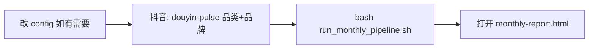

# 使用说明

> 面向第一次用这个仓库的人。技术细节见 [WORKFLOW.md](WORKFLOW.md)，配置字段见 [../config/README.md](../config/README.md)。

---

## 这仓库是干什么的？

一句话：**自动拉小红书 + 抖音近 30 天爆款样本，生成一份 HTML 品牌月报**——告诉你赛道什么内容在火、竞品在发什么、自有品牌该不该跟、该推哪个 SKU。

开源的是**方法和流水线**，不是你的品类数据。  
你要自己填：赛道名、搜索词、监测品牌（见 `config/niche_config.py`）。

---

## 你需要准备什么

| 准备项 | 说明 | 没有会怎样 |
|--------|------|------------|
| **Python 3.10+** | 跑脚本 | 无法执行 |
| **TikHub API Key** | [tikhub.io](https://tikhub.io) 付费，拉 XHS/DY 数据 | 小红书/抖音都拉不动 |
| **social-ecom-decoder** | 本地装好的上游项目，提供 `douyin-pulse` 命令 | 抖音侧 merge 会跳过 |
| **niche_config.py** | 从 example 复制并填写 | 用的是占位示例品牌 |

TikHub Key 放这里（二选一）：

```bash
mkdir -p ~/.config/tikhub
echo "你的key" > ~/.config/tikhub/key
```

抖音上游路径（按你本机实际路径改）：

```bash
export SOCIAL_ECOM_DECODER=~/.claude/skills/social-ecom-decoder
```

---

## 第一次使用（5 步）

### 第 1 步：克隆仓库

```bash
git clone https://github.com/shutiao165-tech/social-ecom-monthly-report.git ~/brand-viral-monthly-report
cd ~/brand-viral-monthly-report
```

### 第 2 步：复制并编辑配置

```bash
cp config/niche_config.example.py config/niche_config.py
```

用编辑器打开 `config/niche_config.py`，**至少改这些**：

```python
NICHE_LABEL = "你的赛道"           # 如「美妆」「宠物食品」
OWN_BRAND = "你的品牌名"
OWN_BRAND_ALIASES = ["你的品牌名", "品牌简称", ...]

BRAND_CANONICAL = ["你的品牌", "竞品1", "竞品2", ...]
BRAND_SEARCH_KEYWORDS = { ... }    # 每个品牌在小红书/抖音怎么搜

CATEGORY_KEYWORDS = ["词1", "词2", ...]  # 品类热点词，不是品牌名
```

改完可快速自检：

```bash
cd scripts && python3 -c "from brand_config import NICHE_LABEL, OWN_BRAND, BRAND_CANONICAL; print(NICHE_LABEL, OWN_BRAND, len(BRAND_CANONICAL))"
```

### 第 3 步：拉抖音数据（douyin-pulse，需手动跑两次）

一键脚本**不会**自动调 douyin-pulse，需要你先在上游项目里跑：

```bash
cd "$SOCIAL_ECOM_DECODER"

# ① 品类池（关键词用你 config 里的 CATEGORY_KEYWORDS，逗号连接）
python3 shared/lib/cli.py douyin-pulse \
  --keywords "词1,词2,词3" \
  --niche "你的品类标签" --days 30 --top-n 30 --min-likes 500 --max-duration 90

# ② 品牌池（可用下面方式自动生成关键词列表）
cd ~/brand-viral-monthly-report/scripts
KW=$(python3 -c "from brand_config import xhs_brand_keywords_flat; print(','.join(xhs_brand_keywords_flat()))")
BR=$(python3 -c "from brand_config import BRAND_CANONICAL; print(','.join(BRAND_CANONICAL))")

cd "$SOCIAL_ECOM_DECODER"
python3 shared/lib/cli.py douyin-pulse \
  --keywords "$KW" --brands "$BR" \
  --per-brand-top 5 --niche "品牌竞品" --days 30 --min-likes 500 --no-push
```

跑完会在 `$SOCIAL_ECOM_DECODER/output/日期/douyin-pulse/` 下生成 `analysis_category.json` 和 `analysis_日期.json`。

### 第 4 步：跑月报流水线

```bash
cd ~/brand-viral-monthly-report
bash scripts/run_monthly_pipeline.sh
```

成功后会输出：`Done: .../monthly-report.html`

### 第 5 步：打开报告

```bash
open monthly-report.html   # macOS
# 或浏览器直接打开该文件
```

---

## 每月怎么重跑？



| 场景 | 命令 |
|------|------|
| **完整重跑**（XHS + DY merge + HTML） | `bash scripts/run_monthly_pipeline.sh` |
| **只重渲染 HTML**（data 已有、改了下文案/逻辑） | `bash scripts/run_monthly_pipeline.sh --build-only` |
| **跳过小红书拉数**（只更新 DY + HTML） | `bash scripts/run_monthly_pipeline.sh --skip-xhs` |
| **手动指定抖音 merge 输入** | `bash scripts/run_monthly_pipeline.sh --dy-category 路径/analysis_category.json --dy-brand 路径/analysis_xxx.json` |

建议节奏：**每月 1 次**全量；月中若只关心抖音，可 `--skip-xhs` 并重新跑 pulse。

---

## 报告里各板块是什么意思？

| 板块 | 回答的问题 |
|------|------------|
| **§01 数据概览** | 本月样本量、双平台 TOP1、自有品牌声量状态 |
| **§02 竞品动作板** | 每个监测品牌在小红书/抖音各最多 3 条代表片；标「自有」的是你的品牌 |
| **§03 自有机会矩阵** | 趋势 × 竞品空白 × 建议 SKU × 跟不跟 |
| **scene_links** | 场景级关联：热点场景、谁在占位、该推什么品 |
| **follow_candidates** | 可跟投候选（品类热点 ∩ 已挂品）；**常为空，为空时页面自动隐藏** |
| **执行方向** | 机会矩阵的展开版，给内容/投放拆任务 |

重要：**品类池爆款赞数 ≠ 品牌代表片赞数**，不要直接比大小（报告 methodology 里也有说明）。

---

## 常见问题

### 1. 跑完 HTML 是空的 / 竞品板全是「未命中」

- 检查 `config/niche_config.py` 品牌词是否和平台真实写法一致
- 小红书：标题/正文须**真的出现**品牌名或搜索词（不能仅靠 TikHub 入库标签）
- 样本池内无内容 ≠ 平台上完全没有该品牌

### 2. 提示 `WARN: DY analysis not found; skip merge`

- 还没跑 douyin-pulse，或 `SOCIAL_ECOM_DECODER` 路径不对
- 解决：按上文「第 3 步」跑 pulse，或 `--dy-category` / `--dy-brand` 手动指定 json 路径

### 3. TikHub 报错 / 余额不足

- 充值 TikHub 后再跑；XHS fetch 和 enrich 都依赖 API

### 4. 我只想改报告样式，不想重新拉数

```bash
bash scripts/run_monthly_pipeline.sh --build-only
```

### 5. 和 Cursor Skill 什么关系？

Skill 是「让 AI 助手知道怎么帮你跑这套流程」。安装：

```bash
cp -R cursor-skills/brand-viral-monthly-report ~/.cursor/skills/
```

然后在 Cursor 里说：「按 brand-viral-monthly-report 帮我跑本月月报」。

---

## 文档索引

| 文档 | 适合谁 |
|------|--------|
| [USAGE.md](USAGE.md)（本文） | 第一次用、每月重跑 |
| [WORKFLOW.md](WORKFLOW.md) | 想搞懂每一步输入输出 |
| [SETUP.md](SETUP.md) | 安装与环境变量 |
| [../config/README.md](../config/README.md) | 配置字段说明 |
| [GITHUB.md](GITHUB.md) | 维护者发布到 GitHub |
