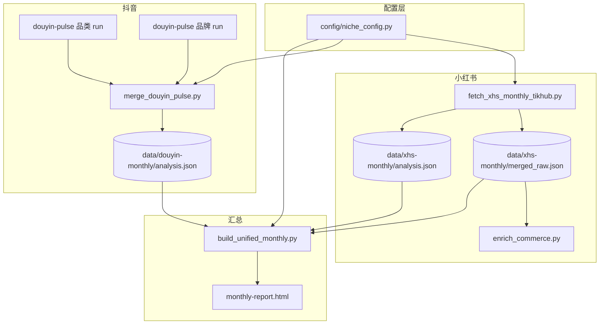
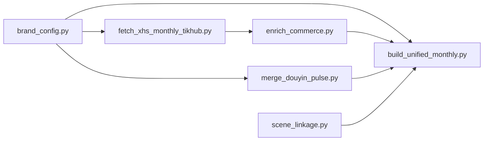

# 流水线详解

> 说明数据从哪来、脚本怎么串、文件落在哪。配合 [USAGE.md](USAGE.md) 阅读。

---

## 总览



**一键入口**：`bash scripts/run_monthly_pipeline.sh`  
（不含 douyin-pulse，pulse 需在上游 `social-ecom-decoder` 里单独跑）

---

## 方案 C：双池模型

| 池 | 搜什么 | 目的 | 脚本 |
|----|--------|------|------|
| **品类池** | `CATEGORY_KEYWORDS` | 赛道全网什么内容在火 | XHS: fetch；DY: pulse `--top-n 30` |
| **品牌池** | `BRAND_SEARCH_KEYWORDS` | 各品牌代表片、挂车动作 | XHS: fetch；DY: pulse `--per-brand-top 5` |

两池**并行**，报告里分开展示；**禁止**用品牌代表片赞数和品类 UGC 爆款直接比。

---

## 逐步说明

### Step 0 — 读配置

| 文件 | 作用 |
|------|------|
| `config/niche_config.py` | 用户填写（git 忽略） |
| `config/niche_config.example.py` | 仓库自带模板 |
| `scripts/load_niche.py` | 加载 config |
| `scripts/brand_config.py` | 对外统一出口 |

所有脚本通过 `brand_config` 读品牌/品类词，**不要在多个 py 里重复写列表**。

---

### Step 1 — 小红书拉数

```bash
python3 scripts/fetch_xhs_monthly_tikhub.py
```

| 输入 | TikHub API + `CATEGORY_KEYWORDS` + 品牌搜索词 |
| 输出 | `data/xhs-monthly/merged_raw.json`（原始双池） |
|      | `data/xhs-monthly/analysis.json`（分析摘要） |

每品类词 TOP30 + 每品牌词若干条，近 30 天窗口。

---

### Step 2 — 商业复核（小红书 + 可选抖音 TOP）

```bash
python3 scripts/enrich_commerce.py
```

| 作用 | 挂品 / 挂车 / 品牌 tag 打标 |
| 读写 | 更新 `merged_raw.json` 内 `commerce` 字段；抖音侧写 `commerce_cache.json` |

---

### Step 3 — 抖音 pulse（上游，本仓库外）

在 `$SOCIAL_ECOM_DECODER` 执行两次 `douyin-pulse`：

1. **品类 run** → `output/<日期>/douyin-pulse/analysis_category.json`
2. **品牌 run** → `output/<日期>/douyin-pulse/analysis_<日期>.json`

原始搜索 json 在同级 `raw/search_*.json`，merge 时会跨批次扫描。

---

### Step 4 — 合并抖音

```bash
python3 scripts/merge_douyin_pulse.py \
  --category path/to/analysis_category.json \
  --brand path/to/analysis_日期.json
```

| 输出 | `data/douyin-monthly/analysis.json` |
| 逻辑 | 品类 TOP30 + 每品牌代表片；品牌命中 = 标题含品牌名或搜索词 |

`run_monthly_pipeline.sh` 会自动找 `$DECODER/output/*/douyin-pulse/` 下最新一批；找不到则 WARN 跳过。

---

### Step 5 — 汇总并写 HTML

```bash
python3 scripts/build_unified_monthly.py
```

| 输入 | `data/xhs-monthly/analysis.json` + `merged_raw.json` |
|      | `data/douyin-monthly/analysis.json` |
|      | `config/niche_config.py`（文案、品牌规则） |
| 输出 | `monthly-report.html`（内嵌 `const DATA = {...}`） |

主要模块：

| 模块 | 脚本函数 / 文件 |
|------|-----------------|
| 趋势/殿堂双池 | `build_xhs_dual_pools` / `build_dy_dual_pools` |
| 竞品动作板 | `build_competitor_actions` |
| 机会矩阵 | `build_opportunity_matrix` + `DIRECTION_PLAYBOOK` |
| 场景关联 | `scene_linkage.build_scene_links` |
| 可跟投 | `scene_linkage.build_follow_candidates`（空则前端隐藏） |
| 页眉文案 | `patch_html` + `REPORT_COPY` |

---

## 目录与产物

```
brand-viral-monthly-report/
├── config/
│   ├── niche_config.example.py   # 模板（提交到 Git）
│   └── niche_config.py           # 你的配置（不提交）
├── data/
│   ├── xhs-monthly/              # 运行后生成（不提交）
│   └── douyin-monthly/
├── scripts/
│   ├── run_monthly_pipeline.sh   # 一键入口
│   ├── fetch_xhs_monthly_tikhub.py
│   ├── enrich_commerce.py
│   ├── merge_douyin_pulse.py
│   └── build_unified_monthly.py
├── monthly-report.html           # 最终报告
└── cursor-skills/                # 复制到 ~/.cursor/skills/
```

---

## run_monthly_pipeline.sh 参数

| 参数 | 含义 |
|------|------|
| （无） | XHS fetch + enrich + DY merge（若找到 pulse）+ build HTML |
| `--build-only` | 只跑 `build_unified_monthly.py` |
| `--skip-xhs` | 跳过 XHS fetch 和 enrich |
| `--skip-dy-merge` | 跳过 merge，直接用已有 `data/douyin-monthly/analysis.json` |
| `--dy-category PATH` | 指定品类 pulse json |
| `--dy-brand PATH` | 指定品牌 pulse json |

---

## 扩展点（可选）

| 能力 | 配置方式 |
|------|----------|
| SKU 映射到机会矩阵 | `templates/brief/` 或 `BRIEF_CATALOG_DIR` |
| 报告标题/导语 | `niche_config.REPORT_COPY` |
| 话题 playbook | `niche_config.DIRECTION_PLAYBOOK` |
| 笔记分类 / 痛点 | `CONTENT_CATEGORIES` / `PAIN_BUCKETS` |

未配置 SKU brief 时，报告仍可生成，SKU 列为空。

---

## 依赖关系图（脚本级）


